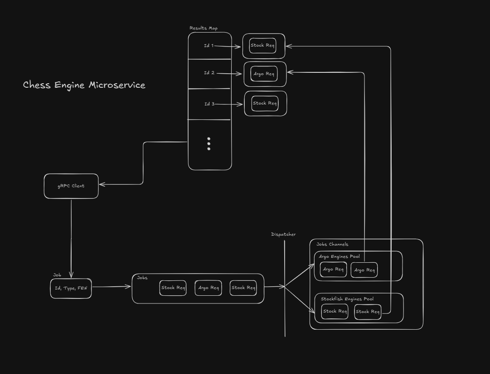

# Chess Engine Microservice


## **Table of Contents**

1. [Overview](#overview)
2. [Features](#features)
3. [Authentication](#authentication)
4. [Architecture](#architecture)
5. [Getting Started](#getting-started)
   1. [Prerequisites](#prerequisites)
   2. [Installation](#installation)
6. [Running the Application](#running-the-application)
7. [Configuration](#configuration)
8. [Testing](#testing)
9. [Deployment](#deployment)
10. [Contributing](#contributing)

## **Overview**

A high-performance, concurrent gRPC microservice for calculating the
best chess moves using various chess engines. Built with Go, it supports
multiple engine types and handles simultaneous requests securely
and efficiently.

---

## **Features**

- **Multiple** Chess Engine Support: Easily integrate multiple engines
  like Stockfish, Komodo, etc.
- **Concurrent** Request Handling: Efficiently process simultaneous requests
  using Go's concurrency model.
- **Engine** Pooling: Manage engine instances through pooling to optimize
  resource usage.
- **Secure** Communication: Implement TLS encryption and token-based authentication.
- **Scalable** Architecture: Containerized deployment with Docker and
  orchestration support.
- **Comprehensive** Testing: Includes unit and integration tests for reliability.
- **Monitoring** and Logging: Structured logging and metrics for monitoring performance.

## **Architecture**

The architecture is represented in the following components and interactions:



### **1. High Level Architecture**

- **Client Application**: Sends gRPC requests with authentication tokens.
- **gRPC Server**: Receives and handles requests, applying authentication.
- **Authentication Interceptor**: Validates tokens and enforces security.
- **Engine Pool**: Manages engine instances for concurrency.
- **Engine Implementations**: Specific implementations for different chess engines.
- **Configuration Loader**: Manages application settings.
- **Testing Modules**: Unit and integration tests to ensure code quality.
- **Docker and Deployment Scripts**: Facilitate containerization and deployment.

### **2. Request Flow**

1. **Client** sends a `GetBestMove` request with `engine_type`, `fen`, and optional
   `depth`, including an authentication token.
2. **gRPC Server** intercepts the request, authenticates it, and passes it
   to the handler.
3. **Server Handler** retrieves an engine instance from the **Engine Pool**.
4. **Engine Instance** computes the best move.
5. **Server Handler** returns the result to the client.
6. **Engine Instance** is returned to the **Engine Pool** for reuse.

---

## Authentication

The service uses token-based authentication. Clients must include a valid
token in the request metadata.

## **Getting Started**

### Prerequisites

<!--  TODO: -->

### Installation

<!--  TODO: -->

### Running the Application

<!--  TODO: -->

### Handling Resource Exhaustion

If the server's engine pool is fully utilized, you may
receive a `ResourceExhausted` error. This indicates that no
engine instances are currently available to process your request.
In such cases, you can:

- Implement retry logic with exponential backoff on the client side.
- Increase the `ENGINE_POOL_SIZE` if server resources allow.
- Optimize client request rates to prevent overwhelming the server.

## **Configuration**

Configuration can be managed via environment variables or a configuration file.

### Environment Variables

- `ENGINE_POOL_SIZE`: Number of engine instances per engine type.
- `AUTH_TOKENS`: Comma-separated list of valid authentication tokens.
- `ENGINE_PATH_STOCKFISH`: File path to the Stockfish binary.
- `ENGINE_PATH_KOMODO`: File path to the Komodo binary.
- `TLS_CERT_FILE`: Path to the TLS certificate file.
- `ENGINE_POOL_SIZE`: Number of engine instances per engine type (default: 5).
- `ENGINE_PATH_STOCKFISH`: File path to the Stockfish binary.
- `ENGINE_PATH_KOMODO`: File path to the Komodo binary (if using Komodo). `TLS_KEY_FILE`: Path to the TLS key file.

Example `.env` File

```env
env
Copy code
ENGINE_POOL_SIZE=5
AUTH_TOKEN=your-secure-token
ENGINE_PATH_STOCKFISH=/usr/local/bin/stockfish
TLS_CERT_FILE=certs/server.crt
TLS_KEY_FILE=certs/server.key
```

## **Testing**

<!--  TODO: -->

## **Deployment**

<!--  TODO: -->

## **Contributing**

Feel free to fork the repository and submit pull requests.
All contributions are welcome to improve the functionality,
scalability, and usability of the microservice.

## **License**

This project is licensed under the MIT License - see the LICENSE file for details.
